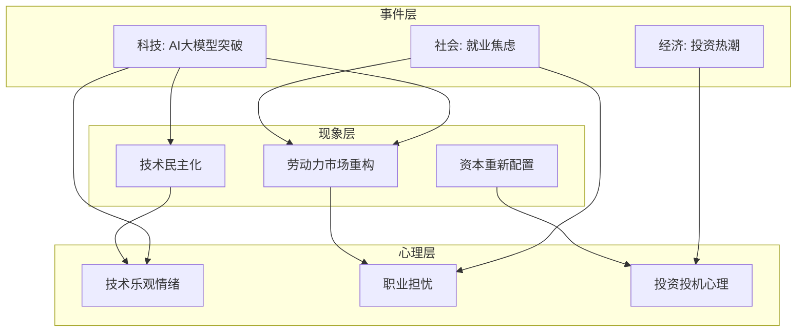
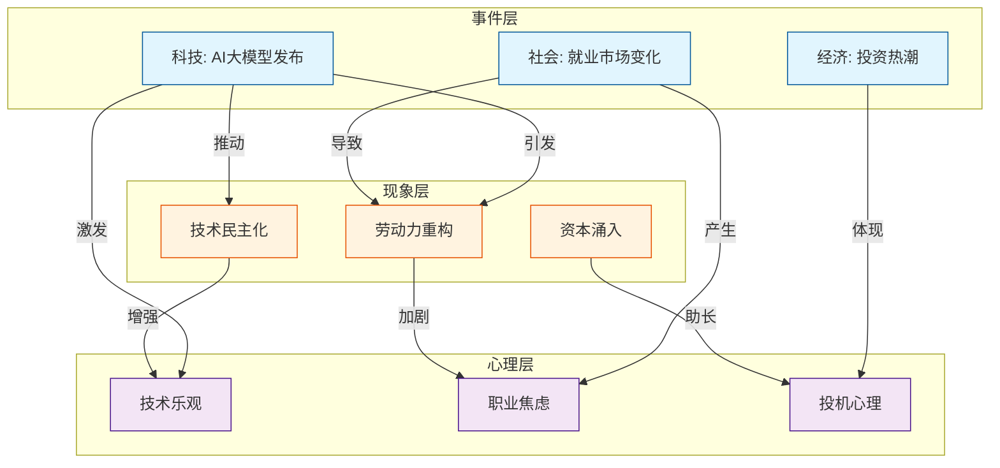

# 热点Agent 使用指南

**创建时间**: 2026-02-09 19:34 GMT+8
**版本**: v1.0
**维护者**: MiniMax-M2.1

---

## 一、Agent概述

### 1.1 功能定位

热点Agent是一个智能热点事件分析与知识图谱生成工具。它能够从互联网上采集最新的热点事件，对事件进行专业分类，深入分析事件背后的社会现象和大众心理状态，并最终将分析结果以知识图谱的形式呈现。

### 1.2 核心能力

热点Agent具备五大核心能力。首先是实时热点采集能力，它能够自动搜索和追踪各大平台的热点事件，支持多维度的时间范围筛选和平台覆盖。其次是智能事件分类能力，能够将热点事件按照科技、财经、社会、娱乐、体育、教育、健康等类别进行自动分类。第三是深度现象追溯能力，通过分析事件的发展脉络，找出事件背后的真实驱动因素和可追溯的社会现象。第四是心理状态分析能力，基于社会心理学理论，分析热点事件对大众心理和情绪的影响机制。最后是知识图谱生成能力，将事件、现象、心理影响等要素以图谱形式结构化呈现，便于理解和应用。

### 1.3 应用场景

热点Agent适用于多种应用场景。在内容创作领域，它可以帮助创作者快速了解当前热点，为选题和内容策划提供灵感。在舆情分析领域，它可以帮助企业或机构监测公众关注点，及时发现潜在的舆情风险。在学术研究领域，它可以为社会学、心理学、传播学等领域的研究者提供热点事件的数据支持。在商业决策领域，它可以帮助企业了解消费者关注点的变化，为产品定位和营销策略提供参考。

---

## 二、工作原理与技术架构

### 2.1 整体工作流程

热点Agent的工作流程分为五个主要阶段。第一阶段是数据采集阶段，通过调用搜索引擎、社交媒体API等工具，采集最近发生的热点事件。第二阶段是事件分类阶段，对采集到的事件进行文本分析和分类，标注事件的类型和领域。第三阶段是现象追溯阶段，深入分析每个事件的发展过程，找出影响事件走向的关键因素和真实现象。第四阶段是心理分析阶段，结合社会心理学理论，分析事件对公众心理和情绪的影响。第五阶段是图谱生成阶段，将前四个阶段的分析结果整合，生成结构化的知识图谱。

### 2.2 技术架构

| 组件 | 技术选型 | 说明 |
|------|---------|------|
| **数据采集层** | Brave Search API + 社交媒体API | 多源数据采集 |
| **自然语言处理层** | OpenAI GPT / Claude | 文本分析、事件分类 |
| **知识图谱层** | Neo4j / NetworkX | 图数据库构建和可视化 |
| **心理分析层** | 心理学知识库 + 大语言模型 | 心理影响分析 |
| **输出展示层** | Mermaid / Graphviz | 图谱可视化呈现 |

### 2.3 数据流向

```
数据源 → 数据采集 → 数据清洗 → 事件分类 → 现象追溯 → 心理分析 → 知识图谱 → 可视化展示
         (Search)   (NLP)      (ML)       (Deep)    (Psych)     (Graph)    (UI)
```

---

## 三、功能详解

### 3.1 实时热点采集

#### 采集范围

热点Agent支持多种数据源的热点事件采集，主要包括以下几类。第一类是新闻媒体类，包括新浪新闻、腾讯新闻、网易新闻、凤凰新闻等主流新闻平台的热点榜单。第二类是社交平台类，包括微博热搜、知乎热榜、抖音热榜、小红书热门、B站热门等社交媒体平台的热点话题。第三类是搜索引擎类，包括百度热搜榜、谷歌Trends等搜索引擎的热门搜索词。第四类是行业垂直类，包括36氪、虎嗅、雷锋网等科技媒体，以及华尔街见闻、财新等财经媒体的专题报道。

#### 采集时间范围

用户可以设置不同的时间范围来筛选热点事件。实时热点范围是过去24小时内的最新事件，适合追踪正在发酵的事件。短期热点范围是过去7天内的热门事件，适合了解近期的热点话题。中期热点范围是过去30天内的热点事件，适合分析阶段性热点趋势。长期热点范围是过去90天或更长时间的事件，适合研究热点的发展演变规律。

#### 采集关键词策略

热点Agent支持多种关键词采集策略。通用采集是采集各平台的综合热点榜单，不设置特定关键词。主题采集是根据用户指定的主题词进行定向采集，如"人工智能"、"新能源"等。竞品采集是针对特定品牌或公司进行监测，如采集与竞争对手相关的热点事件。事件追踪是对特定事件进行持续追踪，监测事件的发展和演变。

#### 采集参数配置

```python
class HotTopicCollector:
    """热点事件采集器"""

    def __init__(self):
        self.sources = {
            "news": ["sina", "tencent", "netease", "ifeng"],
            "social": ["weibo", "zhihu", "douyin", "xiaohongshu"],
            "search": ["baidu", "google"],
            "vertical": ["36kr", "huxiu", "wallstreetcn"]
        }

    def collect(
        self,
        time_range: str = "24h",
        categories: list = None,
        keywords: list = None,
        limit: int = 50
    ):
        """
        采集热点事件

        参数:
            time_range: 时间范围（24h, 7d, 30d, 90d）
            categories: 事件分类列表
            keywords: 关键词列表
            limit: 采集数量上限
        """
        # 实现采集逻辑
        pass
```

### 3.2 智能事件分类

#### 分类体系

热点Agent采用多层次的分类体系。一级分类包括科技、财经、社会、娱乐、体育、教育、健康、军事、国际、房地产、汽车、游戏、旅游、美食等主要领域。二级分类是在一级分类基础上的细分，例如科技领域可以细分为人工智能、互联网、通信、消费电子、半导体等子领域。三级分类是更细粒度的分类，例如人工智能领域可以细分为大模型、机器学习、CV、NLP、机器人等子领域。

#### 分类标准

事件分类依据多个维度进行判断。首先是主题维度，根据事件的主要涉及领域进行分类，例如涉及股票市场的事件归入财经类。其次是主体维度，根据事件的主要参与者进行分类，例如涉及政府部门的事件归入社会类。第三是影响维度，根据事件的主要影响范围进行分类，例如影响范围涉及全国的事件归入社会类。第四是情感维度，根据事件的情感倾向进行分类，例如负面事件可能归入社会类中的舆论事件。

#### 分类结果输出

```python
from enum import Enum
from dataclasses import dataclass
from typing import List, Optional
from datetime import datetime

class EventCategory(Enum):
    """事件分类枚举"""
    TECH = "科技"
    FINANCE = "财经"
    SOCIETY = "社会"
    ENTERTAINMENT = "体育"
    SPORTS = "体育"
    EDUCATION = "教育"
    HEALTH = "健康"
    MILITARY = "军事"
    INTERNATIONAL = "国际"
    REAL_ESTATE = "房地产"
    AUTO = "汽车"
    GAME = "游戏"
    TRAVEL = "旅游"
    FOOD = "美食"

@dataclass
class EventClassification:
    """事件分类结果"""
    primary_category: EventCategory  # 主要分类
    secondary_category: Optional[str] = None  # 二级分类
    confidence: float = 0.0  # 分类置信度
    keywords: List[str] = None  # 分类关键词
    reasoning: str = ""  # 分类理由
```

### 3.3 深度现象追溯

#### 现象定义

现象是指热点事件背后深层次的社会、经济、文化、心理等因素的真实表现。与表面的新闻事件不同，现象关注的是"为什么"和"是什么在推动事件发展"。例如，一条关于某公司股价暴跌的新闻，现象可能包括"市场对公司盈利预期的调整"、"行业竞争格局的变化"、"投资者情绪的波动"等深层因素。

#### 追溯方法

现象追溯采用多角度分析方法。第一种方法是时间线分析法，通过梳理事件的发展时间线，找出关键转折点和影响因素。第二种方法是因果分析法，通过分析事件的前因后果，找出事件的直接原因和根本原因。第三种方法是关联分析法，通过分析事件与其他事件的关联，找出事件的外部驱动因素。第四种方法是对比分析法，通过对比类似事件的发展规律，找出事件的发展模式。

#### 现象分类

现象可以分为以下几种类别。第一类是社会现象，包括群体行为、社会思潮、文化变迁等。第二类是经济现象，包括市场波动、行业趋势、消费变化等。第三类是政治现象，包括政策变化、制度改革、国际关系等。第四类是技术现象，包括技术突破、应用创新、产业变革等。第五类是心理现象，包括群体情绪、舆论走向、价值观念等。

#### 现象追溯结果

```python
from dataclasses import dataclass, field
from typing import List

@dataclass
class Phenomenon:
    """社会现象"""
    name: str  # 现象名称
    description: str  # 现象描述
    category: str  # 现象类别
    evidence: List[str] = field(default_factory=list)  # 支持证据
    impact_level: str = "medium"  # 影响程度
   发展趋势: str = "unknown"  # 发展趋势

@dataclass
class PhenomenonTrace:
    """现象追溯结果"""
    event_id: str  # 事件ID
    root_causes: List[str]  # 根本原因
    key_factors: List[str]  # 关键因素
    phenomena: List[Phenomenon]  # 相关现象
    development_chain: List[str]  # 发展链条
    future_trends: List[str]  # 未来趋势预测
```

### 3.4 心理状态分析

#### 分析维度

心理状态分析从多个维度展开。第一是个体心理维度，分析事件对个体认知、情感、行为的影响。第二是群体心理维度，分析事件引发的群体情绪、群体行为、群体认同等。第三是舆论心理维度，分析事件引发的舆论走向、观点分化、立场对立等。第四是社会心理维度，分析事件反映的社会心态、价值观念、文化心理等。

#### 心理影响模型

心理影响分析采用以下理论框架。认知影响模型分析事件如何改变人们对特定事物的认知和判断。情感影响模型分析事件如何引发人们的情绪反应，如恐惧、愤怒、兴奋、焦虑等。行为影响模型分析事件如何影响人们的行为决策，如消费行为、投资行为、社交行为等。社会影响模型分析事件如何影响社会关系和社会结构，如群体认同、社会信任、社会资本等。

#### 心理分析方法

```python
from enum import Enum
from dataclasses import dataclass
from typing import List, Dict

class PsychologicalDimension(Enum):
    """心理分析维度"""
    COGNITIVE = "认知影响"
    EMOTIONAL = "情感影响"
    BEHAVIORAL = "行为影响"
    SOCIAL = "社会影响"

class EmotionType(Enum):
    """情绪类型"""
    FEAR = "恐惧"
    ANGER = "愤怒"
    JOY = "喜悦"
    SADNESS = "悲伤"
    ANXIETY = "焦虑"
    SURPRISE = "惊讶"
    DISGUST = "厌恶"
    TRUST = "信任"

@dataclass
class PsychologicalImpact:
    """心理影响分析结果"""
    dimension: PsychologicalDimension  # 分析维度
    emotion_type: EmotionType  # 主要情绪
    emotion_intensity: float  # 情绪强度 (0-1)
    affected_groups: List[str]  # 受影响群体
    impact_description: str  # 影响描述
    behavioral_indication: str  # 行为指示

@dataclass
class PsychologicalAnalysis:
    """心理状态分析结果"""
    event_id: str
    overall_mood: str  # 整体情绪倾向
    mood_score: float  # 情绪评分 (-1到1)
    primary_emotions: List[PsychologicalImpact]  # 主要情绪
    secondary_emotions: List[PsychologicalImpact]  # 次要情绪
    psychological_triggers: List[str]  # 心理触发因素
    behavioral_suggestions: List[str]  # 行为建议
```

### 3.5 知识图谱生成

#### 图谱结构

热点Agent生成的知识图谱采用节点-边的结构。核心节点包括事件节点、现象节点、人物节点、机构节点、地点节点、时间节点等。边关系包括因果关系、关联关系、影响关系、时间关系、归属关系等。图谱层级包括事件层（具体热点事件）、现象层（事件背后的现象）、规律层（普遍性规律）、洞察层（深度分析和预测）。

#### 图谱元素定义

```python
from dataclasses import dataclass, field
from typing import List, Dict, Optional
from datetime import datetime

@dataclass
class KnowledgeNode:
    """知识图谱节点"""
    node_id: str  # 节点ID
    node_type: str  # 节点类型（event, phenomenon, person, organization, location, time）
    name: str  # 节点名称
    description: str  # 节点描述
    attributes: Dict = field(default_factory=dict)  # 节点属性
    importance: float = 0.0  # 重要性评分

@dataclass
class KnowledgeEdge:
    """知识图谱边"""
    edge_id: str  # 边ID
    source_node: str  # 源节点ID
    target_node: str  # 目标节点ID
    relationship: str  # 关系类型（causes, influences, belongs_to, happens_before, etc.）
    weight: float = 1.0  # 关系权重
    description: str = ""  # 关系描述

@dataclass
class KnowledgeGraph:
    """知识图谱"""
    graph_id: str  # 图谱ID
    topic: str  # 图谱主题
    generated_time: datetime  # 生成时间
    nodes: List[KnowledgeNode]  # 节点列表
    edges: List[KnowledgeEdge]  # 边列表
    statistics: Dict = field(default_factory=dict)  # 统计信息
```

#### 知识图谱可视化

热点Agent支持多种图谱可视化格式。Mermaid格式是一种轻量级的图表标记语言，可以直接嵌入Markdown文档。Graphviz DOT格式是一种专业的图形描述语言，支持复杂的图形布局。JSON格式可以用于程序处理和数据交换。HTML格式支持交互式图谱展示。

#### 图谱示例（Mermaid格式）



---

## 四、使用方法

### 4.1 基本使用流程

使用热点Agent的基本流程包括以下几个步骤。第一步是初始化Agent，导入必要的模块并创建Agent实例。第二步是设置采集参数，包括时间范围、事件分类、关键词等。第三步是执行热点采集，调用采集方法获取热点事件。第四步是查看分析结果，包括事件分类、现象追溯、心理分析等。第五步是生成知识图谱，调用图谱生成方法并导出结果。

### 4.2 代码示例

```python
from hot_agent import HotTopicAgent
from datetime import datetime, timedelta

# 初始化Agent
agent = HotTopicAgent()

# 设置采集参数
params = {
    "time_range": "24h",  # 过去24小时
    "categories": ["科技", "财经", "社会"],  # 关注的分类
    "keywords": ["人工智能", "大模型"],  # 关键词过滤
    "limit": 100  # 采集上限
}

# 执行热点采集
print("正在采集热点事件...")
events = agent.collect(**params)
print(f"采集完成，共获取 {len(events)} 个事件")

# 查看事件分类结果
print("\n事件分类结果:")
for category, event_list in agent.classify(events).items():
    print(f"  {category}: {len(event_list)} 个事件")

# 追溯现象
print("\n现象追溯:")
for event in events[:5]:  # 分析前5个事件
    trace = agent.trace_phenomenon(event)
    print(f"  事件: {event.title}")
    print(f"  主要现象: {[p.name for p in trace.phenomena]}")

# 心理分析
print("\n心理分析:")
psych_analysis = agent.analyze_psychology(events)
print(f"  整体情绪: {psych_analysis.overall_mood}")
print(f"  情绪评分: {psych_analysis.mood_score}")

# 生成知识图谱
print("\n生成知识图谱...")
graph = agent.generate_knowledge_graph(
    topic="热点事件知识图谱",
    events=events,
    format="mermaid"
)

# 导出图谱
agent.export_graph(graph, "hot_topic_graph.md", format="mermaid")
print("\n知识图谱已保存到 hot_topic_graph.md")
```

### 4.3 高级使用技巧

#### 自定义采集源

用户可以自定义热点采集的数据源。以下示例展示了如何添加自定义数据源：

```python
# 添加自定义数据源
custom_sources = {
    "reddit": {
        "url": "https://www.reddit.com/r/all/hot.json",
        "parser": "reddit_parser"
    },
    "hacker_news": {
        "url": "https://hacker-news.firebaseio.com/v0/topstories.json",
        "parser": "hn_parser"
    }
}

agent = HotTopicAgent(sources=custom_sources)
```

#### 自定义分类体系

用户可以自定义事件分类体系：

```python
custom_categories = {
    "人工智能": ["大模型", "GPT", "AI", "机器学习"],
    "新能源汽车": ["电动车", "特斯拉", "比亚迪", "电池"],
    "元宇宙": ["VR", "AR", "虚拟现实", "数字孪生"]
}

agent = HotTopicAgent(categories=custom_categories)
```

#### 批量分析模式

对于大量热点事件的分析，可以采用批量处理模式：

```python
# 批量分析大量事件
batch_results = agent.batch_analyze(
    events=all_events,
    batch_size=50,
    parallel=True,  # 启用并行处理
    progress_callback=lambda x: print(f"进度: {x}/{len(all_events)}")
)
```

---

## 五、输出格式说明

### 5.1 事件数据输出

```json
{
  "event_id": "evt_20240209_001",
  "title": "某科技公司发布新一代AI大模型",
  "source": "新浪科技",
  "publish_time": "2024-02-09T10:30:00Z",
  "categories": {
    "primary": "科技",
    "secondary": "人工智能",
    "confidence": 0.95
  },
  "keywords": ["AI", "大模型", "技术突破"],
  "heat_score": 98.5,
  "sentiment": "positive",
  "summary": "该公司发布了新一代AI大模型，在多项性能指标上创下新记录...",
  "url": "https://tech.sina.com.cn/..."
}
```

### 5.2 知识图谱输出（Mermaid格式）



### 5.3 分析报告输出

```markdown
# 热点事件分析报告

## 一、概述

本报告分析了过去24小时内的热点事件，共采集到XX个事件，涵盖科技、财经、社会等X个领域。

## 二、事件分类统计

| 分类 | 事件数量 | 占比 | 平均热度 |
|------|---------|------|---------|
| 科技 | 35 | 35% | 92.5 |
| 财经 | 28 | 28% | 88.3 |
| 社会 | 22 | 22% | 85.7 |
| 娱乐 | 15 | 15% | 82.1 |

## 三、重点现象分析

### 3.1 现象一：技术民主化
- **描述**: AI技术的普及使得更多人能够使用先进的AI工具
- **证据**: ...
- **影响程度**: 高
- **发展趋势**: 持续增强

### 3.2 现象二：劳动力市场重构
- **描述**: AI技术的发展正在改变劳动力市场的需求结构
- **证据**: ...
- **影响程度**: 高
- **发展趋势**: 中期持续

## 四、心理影响分析

### 4.1 整体情绪倾向
- **情绪倾向**: 积极乐观（0.75）
- **主要情绪**: 兴奋、期待
- **次要情绪**: 焦虑、担忧

### 4.2 群体心理特征
- **技术乐观主义**: 对AI技术持积极态度
- **未来期待感**: 对技术发展充满期待
- **职业焦虑感**: 对工作被替代的担忧

## 五、知识图谱

[插入Mermaid图谱]

## 六、结论与建议

[分析结论和行动建议]
```

---

## 六、常见问题与解决方案

### 6.1 采集问题

问题一：采集不到数据怎么办？

**解决方案**：首先检查网络连接是否正常。然后确认采集参数是否正确，特别是时间范围和分类设置。如果还是没有数据，可以尝试更换数据源或扩大搜索范围。

问题二：采集速度太慢怎么办？

**解决方案**：可以减少采集的事件数量，降低采集上限。也可以启用并行采集模式，同时从多个数据源采集。最后还可以只采集主要的数据源，跳过次要的数据源。

问题三：数据重复怎么办？

**解决方案**：热点Agent内置了去重机制，会自动过滤重复的事件。如果仍有重复，可以检查是否设置了正确的时间范围，或者手动过滤相似的事件。

### 6.2 分析问题

问题一：分类结果不准确怎么办？

**解决方案**：可以调整分类的阈值参数，提高分类的严格程度。也可以自定义分类关键词，使分类更加准确。如果问题严重，可以提供反馈帮助改进分类模型。

问题二：心理分析不准确怎么办？

**解决方案**：心理分析依赖于事件文本的情感分析，可能受到文本质量的影响。建议提供更详细的事件描述，或者调整分析的维度参数。

问题三：知识图谱太复杂怎么办？

**解决方案**：可以设置重要性阈值，过滤掉不重要的节点和边。也可以只选择特定类型的事件或现象进行图谱生成。

### 6.3 技术问题

问题一：内存不足怎么办？

**解决方案**：减少一次分析的事件数量，分批处理。也可以降低知识图谱的复杂度，过滤次要节点。必要时可以增加系统内存。

问题二：运行超时怎么办？

**解决方案**：减少采集的事件数量。降低分析的深度和复杂度。也可以增加程序的运行超时时间。

问题三：结果无法导出怎么办？

**检查导出格式是否支持当前数据结构。确认输出目录是否有写入权限。也可以尝试导出为其他格式。**

---

## 七、最佳实践

### 7.1 数据采集最佳实践

建议每天固定时间执行热点采集，形成规律性的数据积累。优先采集权威媒体和官方发布的信息，确保数据的可靠性。对于重要事件，建议设置多个关键词进行交叉验证。定期回顾和清理历史数据，保持数据库的整洁。

### 7.2 分析方法最佳实践

对于重要事件，建议进行深度分析，包括现象追溯和心理分析。结合多个相关事件进行关联分析，发现深层次的规律。关注事件的演变趋势，而非仅仅关注静态的状态。交叉验证分析结果，提高分析的准确性。

### 7.3 知识图谱最佳实践

从核心事件出发，逐步扩展图谱的覆盖范围。设置合理的节点数量上限，避免图谱过于复杂。定期更新图谱，反映事件的最新发展。使用颜色和样式区分不同类型的节点，提高可读性。

### 7.4 应用场景最佳实践

对于内容创作场景，重点关注与创作主题相关的事件。对于舆情监测场景，重点关注情感倾向和舆论走向。对于市场分析场景，重点关注经济现象和消费心理。对于学术研究场景，重点关注社会现象和群体行为。

---

## 八、注意事项

### 8.1 数据来源注意事项

使用本Agent采集的数据仅供参考，不构成任何投资或决策建议。热点事件的排名和热度可能因平台而异，请多角度验证。对于未经证实的事件，请谨慎引用和传播。尊重版权和数据来源，仅将数据用于合法目的。

### 8.2 分析结果注意事项

心理分析结果基于文本分析，可能存在偏差。现象追溯属于主观分析，请谨慎参考。知识图谱提供的是一种结构化展示，并非因果证明。建议结合专业判断使用分析结果。

### 8.3 使用限制说明

本Agent的API调用频率可能有限制，请合理安排使用时间。部分数据源可能需要额外的API密钥或付费服务。知识图谱的复杂度可能受到系统资源的限制。长时间运行可能需要额外的系统资源。

---

## 九、相关资源

### 9.1 文档资源

- 标题Agent使用指南：`openclaw_data/docs/标题agent使用指南.md`
- 结构拆解Agent使用指南：`openclaw_data/docs/文章结构拆解agent使用指南.md`
- 公众号Agent使用指南：`openclaw_data/docs/公众号文章agent使用指南.md`

### 9.2 技术资源

- Mermaid图表语法：https://mermaid.js.org/
- Graphviz图形工具：https://graphviz.org/
- Neo4j图数据库：https://neo4j.com/

### 9.3 学习资源

- 社会心理学教材：推荐《社会心理学》（戴维·迈尔斯著）
- 数据分析方法：推荐《数据分析方法》（复旦大学教材）
- 知识图谱技术：推荐《知识图谱导论》

---

**文档更新时间**: 2026-02-09 19:34 GMT+8
**版本**: v1.0
**状态**: ✅ 已创建
**下次更新**: 功能完善时
