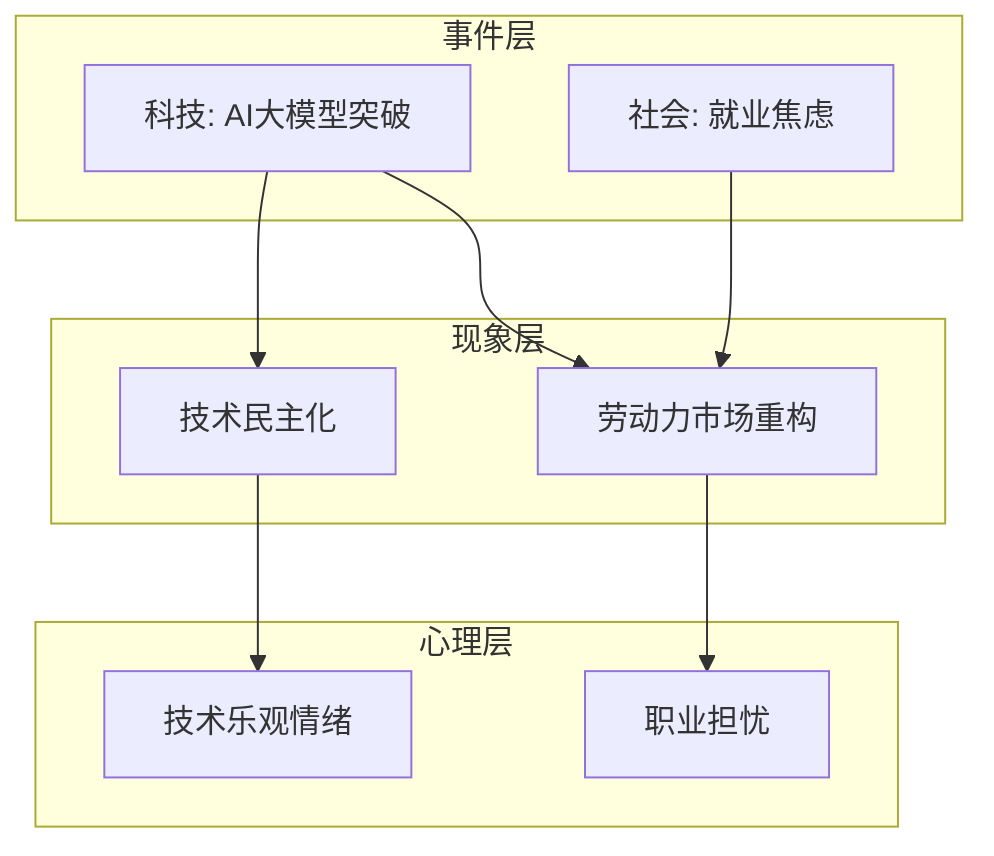

# 热点Agent技能模块

**创建时间**: 2026-02-09 19:39 GMT+8
**版本**: v1.0
**分类**: 热点分析 / 知识图谱

---

## Agent概述

### 核心能力

热点Agent是一个智能热点事件分析与知识图谱生成工具，具备以下五大核心能力：

1. **实时热点采集** - 自动搜索和追踪多平台热点事件，支持多维度时间范围筛选
2. **智能事件分类** - 基于主题、主体、影响、情感的多维度自动分类
3. **深度现象追溯** - 通过时间线分析、因果分析等方法追溯事件背后的真实现象
4. **心理状态分析** - 基于社会心理学理论分析事件对公众心理和情绪的影响
5. **知识图谱生成** - 将事件、现象、心理影响等要素以结构化图谱形式呈现

### 技术架构

| 组件 | 技术选型 | 说明 |
|------|---------|------|
| **数据采集** | Brave Search API + 社交媒体API | 多源数据采集 |
| **自然语言处理** | OpenAI GPT / Claude | 文本分析、事件分类 |
| **知识图谱** | Neo4j / NetworkX | 图数据库构建和可视化 |
| **心理分析** | 心理学知识库 + 大语言模型 | 心理影响分析 |
| **可视化** | Mermaid / Graphviz | 图谱展示 |

### 应用场景

- **内容创作** - 快速了解当前热点，为选题和内容策划提供灵感
- **舆情分析** - 监测公众关注点，发现潜在舆情风险
- **学术研究** - 为社会学、心理学等领域提供热点事件数据支持
- **商业决策** - 了解消费者关注点变化，为产品定位和营销策略提供参考

---

## 功能详解

### 1. 热点事件采集

#### 支持的数据源

| 类型 | 数据源 | 说明 |
|------|--------|------|
| 新闻媒体 | 新浪、腾讯、网易、凤凰 | 主流新闻平台热点榜单 |
| 社交平台 | 微博、知乎、抖音、小红书、B站 | 社交媒体热点话题 |
| 搜索引擎 | 百度、谷歌 | 热门搜索词趋势 |
| 行业垂直 | 36氪、虎嗅、财新 | 科技财经专业媒体 |

#### 采集参数

```python
class HotTopicCollector:
    """热点事件采集器"""

    def collect(
        self,
        time_range: str = "24h",  # 时间范围: 24h, 7d, 30d, 90d
        categories: list = None,    # 分类筛选
        keywords: list = None,      # 关键词过滤
        sources: list = None,       # 数据源筛选
        limit: int = 50             # 采集数量上限
    ):
        """采集热点事件"""
        pass
```

### 2. 事件分类

#### 分类体系

```
一级分类: 科技、财经、社会、娱乐、体育、教育、健康、军事、国际...
↓
二级分类: 人工智能、互联网、移动通信、消费电子...
↓
三级分类: 大模型、机器学习、CV、NLP、机器人...
```

#### 分类维度

- **主题维度**: 根据事件主要涉及领域分类
- **主体维度**: 根据事件主要参与者分类
- **影响维度**: 根据事件影响范围分类
- **情感维度**: 根据事件情感倾向分类

### 3. 现象追溯

#### 分析方法

| 方法 | 说明 | 应用场景 |
|------|------|---------|
| 时间线分析 | 梳理事件发展时间线，找出关键转折点 | 追踪事件演变 |
| 因果分析 | 分析事件前因后果，找原因和结果 | 理解事件逻辑 |
| 关联分析 | 分析事件与其他事件的关联 | 发现关联事件 |
| 对比分析 | 对比类似事件的发展规律 | 预测发展趋势 |

#### 现象类型

- **社会现象**: 群体行为、社会思潮、文化变迁
- **经济现象**: 市场波动、行业趋势、消费变化
- **政治现象**: 政策变化、制度改革、国际关系
- **技术现象**: 技术突破、应用创新、产业变革
- **心理现象**: 群体情绪、舆论走向、价值观念

### 4. 心理分析

#### 分析维度

| 维度 | 分析内容 |
|------|---------|
| 认知影响 | 事件如何改变人们对特定事物的认知和判断 |
| 情感影响 | 事件引发的情绪反应（恐惧、愤怒、兴奋、焦虑等） |
| 行为影响 | 事件如何影响人们的行为决策 |
| 社会影响 | 事件如何影响社会关系和社会结构 |

#### 情绪类型

```
恐惧 → 愤怒 → 喜悦 → 悲伤 → 焦虑 → 惊讶 → 厌恶 → 信任
```

### 5. 知识图谱生成

#### 图谱结构

```python
@dataclass
class KnowledgeNode:
    """知识图谱节点"""
    node_id: str           # 节点ID
    node_type: str         # 节点类型（event, phenomenon, person, organization...）
    name: str              # 节点名称
    description: str       # 节点描述
    importance: float      # 重要性评分（0-1）

@dataclass
class KnowledgeEdge:
    """知识图谱边"""
    source_node: str       # 源节点ID
    target_node: str       # 目标节点ID
    relationship: str      # 关系类型（causes, influences, belongs_to...）
    weight: float          # 关系权重（0-1）
```

#### 可视化格式

- **Mermaid格式**: 轻量级图表标记语言，可嵌入Markdown
- **Graphviz DOT格式**: 专业图形描述语言
- **JSON格式**: 程序处理和数据交换
- **HTML格式**: 交互式图谱展示

---

## 使用示例

### 基本使用

```python
from hot_agent import HotTopicAgent

# 初始化Agent
agent = HotTopicAgent()

# 采集热点事件
events = agent.collect(
    time_range="24h",
    categories=["科技", "财经", "社会"],
    limit=100
)

# 生成知识图谱
graph = agent.generate_knowledge_graph(
    topic="热点事件知识图谱",
    events=events,
    format="mermaid"
)

# 导出图谱
agent.export_graph(graph, "output/graph.md")
```

### 高级配置

```python
# 自定义数据源
custom_sources = {
    "reddit": "https://www.reddit.com/r/all/hot.json",
    "hacker_news": "https://hacker-news.firebaseio.com/v0/topstories.json"
}
agent = HotTopicAgent(sources=custom_sources)

# 自定义分类体系
custom_categories = {
    "人工智能": ["大模型", "GPT", "AI", "机器学习"],
    "新能源汽车": ["电动车", "特斯拉", "比亚迪", "电池"]
}
agent = HotTopicAgent(categories=custom_categories)
```

---

## 输出示例

### Mermaid知识图谱



### 分析报告结构

```
# 热点事件分析报告

## 一、概述
- 采集时间范围
- 事件总数和分类统计

## 二、事件分类统计
| 分类 | 数量 | 占比 | 平均热度 |
|------|------|------|---------|

## 三、重点现象分析
### 3.1 现象一：xxx
- 描述、证据、影响程度、发展趋势

## 四、心理影响分析
- 整体情绪倾向
- 主要情绪类型
- 群体心理特征

## 五、知识图谱
[插入Mermaid图谱]

## 六、结论与建议
```

---

## 最佳实践

### 数据采集

- 每天固定时间执行，形成规律性数据积累
- 优先采集权威媒体信息
- 设置多个关键词进行交叉验证
- 定期回顾和清理历史数据

### 分析方法

- 对于重要事件进行深度分析
- 结合多个相关事件进行关联分析
- 关注事件的演变趋势
- 交叉验证分析结果

### 知识图谱

- 从核心事件出发，逐步扩展
- 设置节点数量上限，避免过于复杂
- 定期更新图谱，反映最新发展
- 使用颜色区分不同类型节点

---

## 相关文档

- 使用指南: `openclaw_data/docs/热点agent使用指南.md`
- 标题Agent: `openclaw_data/docs/标题agent使用指南.md`
- 结构拆解Agent: `openclaw_data/docs/文章结构拆解agent使用指南.md`

---

**文档更新时间**: 2026-02-09 19:39 GMT+8
**版本**: v1.0
**状态**: ✅ 已创建
