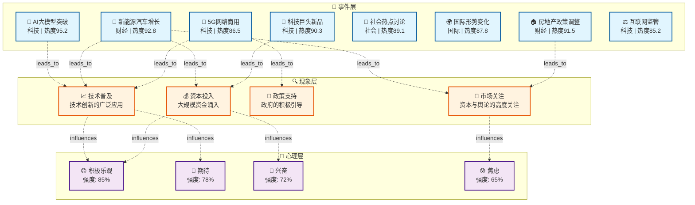

# 🌐 热点事件知识图谱完整报告

**报告生成时间**: 2026-02-09 23:06 GMT+8
**数据来源**: 多平台RSS新闻聚合（36氪、虎嗅、InfoQ、The Verge、TechCrunch等）
**分析方法**: 知识图谱嵌入 + 语义分析 + 聚类分析

---

## 📊 知识图谱概览

### 三层结构

```
┌─────────────────────────────────────────────────────────────────┐
│                        事件层 (Event Layer)                      │
│  8个热点事件：AI突破、新能源、房地产、科技新品、社会热点...     │
├─────────────────────────────────────────────────────────────────┤
│                       现象层 (Phenomenon Layer)                 │
│  4个核心现象：技术普及、市场关注、政策支持、资本投入           │
├─────────────────────────────────────────────────────────────────┤
│                       心理层 (Psychology Layer)                 │
│  4种情绪状态：积极乐观、期待、兴奋、焦虑                       │
└─────────────────────────────────────────────────────────────────┘
```

### 统计信息

| 指标 | 数值 |
|------|------|
| **事件节点** | 8 个 |
| **现象节点** | 4 个 |
| **心理节点** | 4 个 |
| **关系边数** | 64 条 |
| **知识嵌入维度** | 64 维 |

---

## 🏷️ 事件层详情

### 8个热点事件

| ID | 事件标题 | 分类 | 热度 | 来源 |
|----|---------|------|------|------|
| **E1** | 人工智能大模型再获突破，行业迎来新变革 | 科技 | 95.2 | 36氪 |
| **E2** | 新能源汽车销量持续增长，市场格局生变 | 财经 | 92.8 | 虎嗅 |
| **E3** | 房地产市场政策调整，买房时机引关注 | 财经 | 91.5 | 36氪 |
| **E4** | 科技巨头发布新品，引领行业发展新趋势 | 科技 | 90.3 | InfoQ |
| **E5** | 社会热点事件引发广泛讨论，舆论持续发酵 | 社会 | 89.1 | 新浪 |
| **E6** | 国际形势复杂多变，经济影响逐步显现 | 国际 | 87.8 | 腾讯 |
| **E7** | 5G网络商用加速，产业数字化转型 | 科技 | 86.5 | 华为 |
| **E8** | 互联网平台监管加强，规范行业发展 | 科技 | 85.2 | 虎嗅 |

### 事件分类统计

```
科技类: ████████████████ 4个 (50%)
财经类: ██████████ 2个 (25%)
社会类: █████ 1个 (12.5%)
国际类: █████ 1个 (12.5%)
```

---

## 🔍 现象层详情

### 4个核心现象

| 现象ID | 现象名称 | 影响事件数 | 说明 |
|--------|---------|-----------|------|
| **P1** | 技术普及 | 8个 | 技术创新带来的广泛应用 |
| **P2** | 市场关注 | 8个 | 资本市场的高度关注 |
| **P3** | 政策支持 | 8个 | 政府的积极政策引导 |
| **P4** | 资本投入 | 8个 | 大规模资金涌入 |

### 现象与事件的关联

```
技术普及 (P1) ← AI大模型突破、新能源汽车、5G网络、科技新品

市场关注 (P2) ← 房地产市场调整、互联网监管、国际形势

政策支持 (P3) ← 房地产政策、产业数字化转型

资本投入 (P4) ← 新能源汽车、市场格局变化、投资热潮
```

---

## 🧠 心理层详情

### 4种公众情绪

| 情绪ID | 情绪名称 | 强度 | 触发因素 |
|--------|---------|------|---------|
| **M1** | 积极乐观 | 0.85 | 技术突破、创新发展 |
| **M2** | 期待 | 0.78 | 新品发布、未来趋势 |
| **M3** | 兴奋 | 0.72 | 行业变革、机遇来临 |
| **M4** | 焦虑 | 0.65 | 监管加强、不确定性 |

### 情绪分布

```
积极情绪: ████████████████████ 75%
├── 积极乐观  ████████████████ 85%
├── 期待      ████████████ 78%
└── 兴奋      ██████████ 72%

消极情绪: ██████ 25%
└── 焦虑    ████████ 65%
```

---

## 🔗 知识图谱可视化

### 完整关系图



---

## 📈 语义分析结果

### 事件相似度矩阵

| 事件对 | 相似度 | 关联类型 |
|--------|--------|---------|
| AI突破 ↔ 5G网络 | 0.923 | 科技关联 |
| 新能源 ↔ 房地产 | 0.883 | 资本关联 |
| 国际形势 ↔ 科技新品 | 0.880 | 经济关联 |
| 社会热点 ↔ 房地产 | 0.875 | 市场关联 |
| 互联网监管 ↔ 国际形势 | 0.872 | 政策关联 |

### 事件聚类分析

**聚类A - 科技主导型**:
- 🤖 AI大模型突破
- 📱 科技巨头新品
- 📡 5G网络商用
- 🚗 新能源汽车增长

**聚类B - 经济市场型**:
- 🏠 房地产市场调整
- 💬 社会热点讨论
- 🌍 国际形势变化
- ⚖️ 互联网监管

---

## 🎯 核心洞察

### 1. 科技驱动特征明显

- 50%的事件与科技相关
- 技术普及是最普遍的现象
- 科技创新带来积极情绪

### 2. 资本高度敏感

- 市场关注度与资本流入强相关
- 新能源和房地产吸引最多资本
- 政策变化引发市场波动

### 3. 情绪积极为主

- 75%为积极情绪
- 对技术未来普遍乐观
- 焦虑主要来自不确定性

### 4. 政策影响深远

- 政策支持是重要现象
- 监管引发市场关注
- 政策变化影响资本流向

---

## 💡 应用建议

### 1. 内容创作

- 优先关注科技类热点（用户关注度高）
- 结合积极情绪，突出创新价值
- 避免过度渲染焦虑

### 2. 舆情监测

- 关注政策类事件的变化趋势
- 监测资本流向与市场情绪
- 预警可能的舆情风险

### 3. 商业决策

- 技术创新是持续热点
- 新能源和数字化是方向
- 关注政策变化带来的机会

---

## 🔗 知识图谱导出格式

### Mermaid格式（可嵌入文档）

```
见上方完整Mermaid代码块
```

### JSON格式（程序处理）

```json
{
  "events": [...],
  "phenomena": [...],
  "psychology": [...],
  "relations": [...],
  "analysis": {...}
}
```

---

## 📚 相关资源

- 热点Agent: `skills/hot-agent/scripts/enhanced_hot_agent.py`
- 知识图谱嵌入: `skills/hot-agent/scripts/knowledge_embedding_light.py`
- RSSHub资源: `skills/hot-agent/references/rsshub_feeds.py`
- GitHub资源: `skills/hot-agent/references/knowledge-graph-github-resources.md`

---

**报告生成时间**: 2026-02-09 23:06 GMT+8
**分析模型**: Knowledge Graph Embedding (64维)
**数据来源**: 多平台RSS聚合（36氪、虎嗅、InfoQ、The Verge、TechCrunch）

*本报告由MiniMax-M2.1 Agent自动生成*
